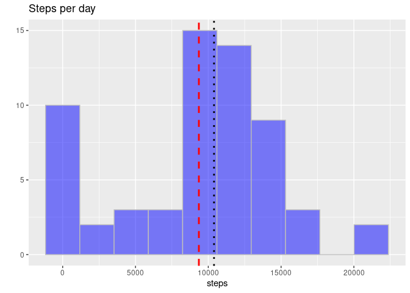
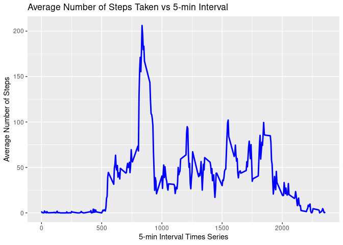
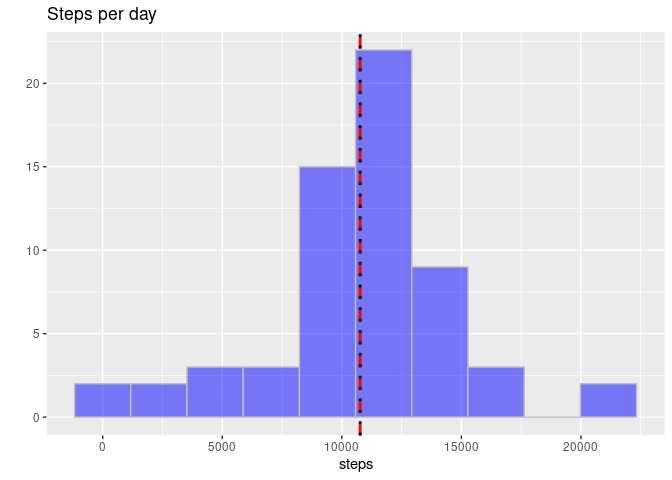
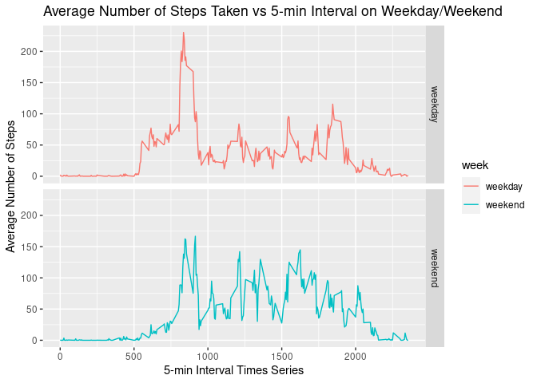

## Pre Analysis
Loading necessary packages. We will use ``dplyr`` to clean and explore data and
``ggplot2`` to plot it.

```r
library("dplyr")
library("ggplot2")
```

## Loading and preprocessing the data ###
### Downloading the data

```r
file <- "activity.zip"
url <- "https://d396qusza40orc.cloudfront.net/repdata%2Fdata%2Factivity.zip"
dir <- "data"

if(!file.exists(file)){
  download.file(url,file, mode = "wb") 
}

if(!file.exists(dir)){
  unzip("activity.zip", files = NULL, exdir=".")
}
```

### Reading and cleaning data

```r
activity <- read.csv("activity.csv")
activity <- tibble(activity)

activity$date <- as.Date(activity$date, format = "%Y-%m-%d")
```

## What is mean total number of steps taken per day?
To calculate the total number of steps taken per day, we will group ``activity`` by feature ``date`` and sum by ``steps``, ignoring the \color{red}{\verb|NA|}NA values.
After that, we plot a histogram of the total number of steps taken each day.

```r
steps_per_day <- activity %>% 
  group_by(date) %>% 
  summarise(steps = sum(steps, na.rm = TRUE))

mean.activity <- round(mean(steps_per_day$steps))
median.activity <- median(steps_per_day$steps)

p<- qplot(steps_per_day$steps,
      geom="histogram",
      main = "Steps per day", 
      xlab = "steps",  
      fill=I("blue"), 
      col=I("gray"), 
      alpha=I(.5),
      bins=10
      )+ 
  geom_vline(xintercept=mean.activity, colour="red", linetype="dashed", size=1) +
  geom_vline(xintercept=median.activity, colour="black" , linetype="dotted", size=1)

p
```

<!-- -->

We also draw in the graph above two vertical lines: a red and a black line that represents the mean and median of the total number of steps taken per day, respectively. The output below reports the mean and median values:


```
## [1] "The mean value of total number of steps taken per day was 9354 and the median was 10395"
```

## What is the average daily activity pattern?
To compute the average daily activity pattern we group the original date by the feature ``interval``, and get the mean of the steps for each 5-min interval of a day. Then, we make a time series plot of the 5-minute interval (x-axis) and the average number of steps taken, averaged across all days (y-axis) as you can see below

```r
intervals <- activity %>% 
  group_by(interval) %>% 
  summarise(step.mean = mean(steps, na.rm = TRUE))

plot.interval <- ggplot(intervals, aes(x=interval,y=step.mean)) + 
  geom_line(color="blue", size=1) + 
  labs(title="Average Number of Steps Taken vs 5-min Interval", y="Average Number of Steps", x="5-min Interval Times Series")
plot.interval
```

<!-- -->

```r
max.steps <- intervals$interval[which.max(intervals$step.mean)]
```
To compute which 5-minute interval contains the maximum number of steps we define a new variable called ``max.steps`` that computes it. The output below answers this question


```
## [1] "Maximum number of steps is coming from 835th 5-min interval"
```

## Imputing missing values
Note that there are a number of days/intervals where there are missing values (coded as \color{red}{\verb|NA|}NA). The presence of missing days may introduce bias into some calculations or summaries of the data. The following output will return the number of \color{red}{\verb|NA|}NA values

```r
na.values <- sum(is.na(activity$steps))
sprintf("Number of NA values in the data is %g", na.values)
```

```
## [1] "Number of NA values in the data is 2304"
```

To solve this, we will define a new data ``actvnew`` in which each NA value of the 'step' column in ``activity`` is replaced by the average step value for the corresponding interval

```r
actvnew <- merge(activity, intervals)
actvnew$steps <- coalesce(actvnew$steps, actvnew$step.mean)
```

Plotting again a histogram of the total number of steps taken each day, now with the new data


```r
steps_per_day <- actvnew %>% 
  group_by(date) %>% 
  summarise(steps = sum(steps))

mean.activity <- round(mean(steps_per_day$steps))
median.activity <- median(steps_per_day$steps)

p<- qplot(steps_per_day$steps,
          geom="histogram",
          main = "Steps per day", 
          xlab = "steps",  
          fill=I("blue"), 
          col=I("gray"), 
          alpha=I(.5),
          bins=10
)+ 
  geom_vline(xintercept=mean.activity, colour="red", linetype="dashed", size=1) +
  geom_vline(xintercept=median.activity, colour="black" , linetype="dotted", size=1)

p
```

<!-- -->

We also draw in the graph above two vertical lines: a red and a black line that represents the mean and median of the total number of steps taken per day, respectively. The output below reports the mean and median values:


```
## [1] "The mean value of total number of steps taken per day was 10766 and the median was 10766.2"
```

Note that the mean and median of the total number of steps differ from that computed ignoring the missing data. This happened because we choose to replace the missing data using the average steps of the corresponding interval. Also, note that the step distribution by day is closer to a normal distribution and there are fewer days with 0 (or not recorded) number of steps.
## Are there differences in activity patterns between weekdays and weekends?

To verify if there are differences in activity patterns between weekdays and weekends we create a new variable called ``week`` that indicates whether a given date is a weekday or weekend day. After that we make a panel plot containing a time series plot of the 5-minute interval (x-axis) and the average number of steps taken, averaged across all weekday days or weekend days (y-axis). Se the graph below


```r
actvnew$week <- weekdays(activity$date)
actvnew$week <- ifelse(weekdays(actvnew$date) %in% c("sábado", "domingo"), "weekend", "weekday")

# Preparing data for ggplot
df.ww <- actvnew %>% group_by(interval, week) %>% summarise(mean.step=mean(steps))

# Plot Average steps across weekday/weekend vs 5-min interval Time Series
plot.weekday.interval <- ggplot(df.ww, aes(x=interval, y=mean.step, color=week)) + 
  facet_grid(week~.) +
  geom_line() + 
  labs(title="Average Number of Steps Taken vs 5-min Interval on Weekday/Weekend", y="Average Number of Steps", x="5-min Interval Times Series")
plot.weekday.interval
```

<!-- -->

We can see that *yes*, there are differences between weekdays and weekends. The graph shows that during the week there is more activity and a higher peak, but during the weekend that activity is more distributed during the day.
